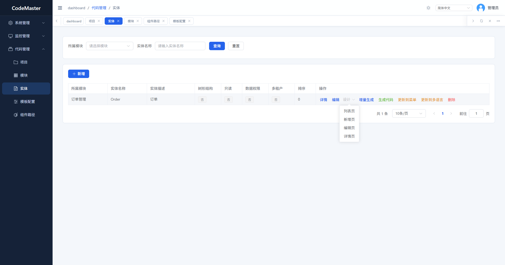
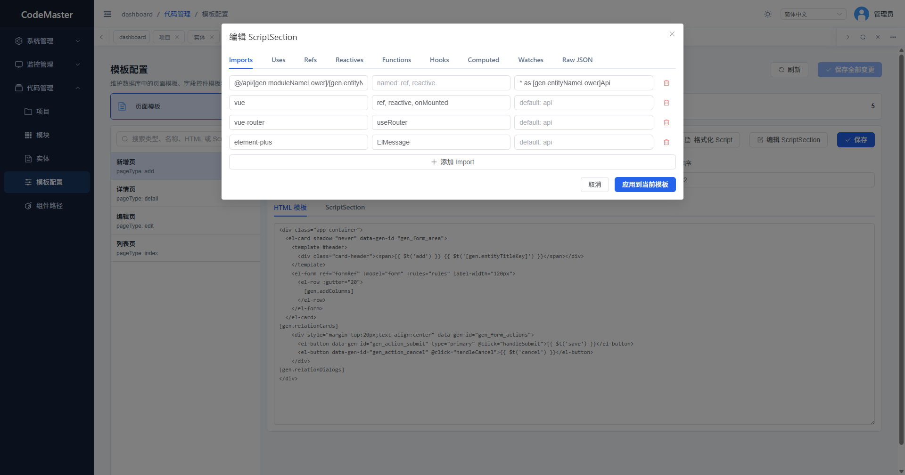
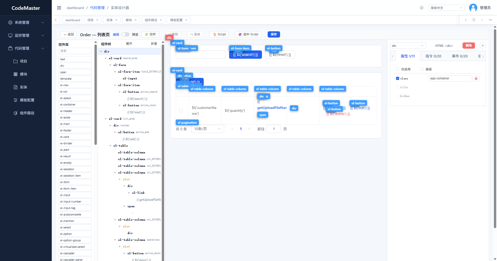

# CodeMaster

[English](README.en.md) | 简体中文

- 官网：[http://124.221.136.83:8000](http://124.221.136.83:8000)
- 开源仓库：[https://gitee.com/cwj19851010/code-master](https://gitee.com/cwj19851010/code-master)

CodeMaster 是一个面向 **.NET 10 + Vue 3** 的企业级快速开发平台。它以“约定大于配置”为核心思想，让团队先定义项目、模块、实体和字段，再自动生成可运行、可维护、可持续演进的前后端工程。

> 当前状态：早期预览版。核心框架、代码生成、模板设计器、MCP 集成和 Tauri 客户端流程已经可用，但 v1.0 前 API、模板和部分交互仍可能调整。

## 核心能力

- **约定式建模**：定义项目、模块、实体和字段后，自动生成后端服务、DTO、前端页面、菜单、权限、语言资源和迁移数据。
- **动态 API**：应用服务可通过约定自动暴露为 REST API，减少重复 Controller 编写。
- **自动权限**：根据服务、菜单、按钮和生成规则自动维护权限编码，降低权限遗漏风险。
- **模板化代码生成**：页面模板、字段控件模板、子表模板存储在数据库中，可在系统界面维护。
- **全量与增量生成**：支持从零生成项目，也支持对既有生成项目做增量更新，尽量保留用户自定义脚本区。
- **MCP 智能体集成**：AI 可以通过 MCP 工具新增/编辑项目、模块、实体、字段，执行初始化、生成代码和启动服务。
- **Tauri + LocalAgent 客户端**：桌面客户端可调用本地能力，例如本地初始化、生成代码、启动生成项目的前后端。
- **多租户基础能力**：内置租户上下文、菜单范围、JWT 租户声明和数据权限扩展点。
- **企业开发栈**：ASP.NET Core、SqlSugar、EF Core Migrator、Vue 3、Element Plus、Vite、SignalR、Quartz、Redis 可选缓存。

## 产品截图

### 项目实体管理



### 模板配置



### 实体设计器



## 项目结构

```text
CodeMaster.WebApi          ASP.NET Core API、动态 API、Controller、中间件
CodeMaster.Application     应用服务、DTO、代码生成、模板和 MCP 相关业务
CodeMaster.Domain          领域实体
CodeMaster.Infrastructure  SqlSugar、仓储、认证授权、SignalR、Quartz、中间件
CodeMaster.Core            基础实体、接口、公共抽象
CodeMaster.Migrator        EF Core 迁移和种子数据
CodeMaster.Vue             Vue 3 管理端和 Tauri 客户端源码
CodeMaster.LocalAgent      桌面客户端使用的本地 sidecar 服务
CodeMaster.McpServer       面向 AI 代码生成流程的 MCP 服务
Templates                  生成项目使用的源码模板包
```

## 技术栈

- .NET SDK 10
- ASP.NET Core Web API
- SqlSugar 运行时 ORM
- EF Core Migrator
- Vue 3 + Element Plus + Vite
- Pinia + vue-i18n
- SignalR
- Quartz
- Tauri + LocalAgent
- MySQL 默认示例配置

运行时代码支持 SQLite、PostgreSQL、MySQL、SQL Server、Oracle。EF 迁移历史不提交到仓库，初始化或部署时应根据当前选择的数据库 provider 重新生成并验证迁移。

## 快速开始

当前仓库使用本地 MySQL 示例配置和占位密钥。正式部署前请改成自己的连接串和密钥。

1. 还原并构建：

```bash
dotnet restore CodeMaster.sln
dotnet build CodeMaster.sln
```

2. 创建数据库并初始化种子数据：

```bash
createdb -h localhost -U postgres CodeMasterDB
cd CodeMaster.Migrator
dotnet run
```

3. 启动后端：

```bash
cd CodeMaster.WebApi
dotnet run
```

4. 启动前端：

```bash
cd CodeMaster.Vue
npm install
npm run dev
```

默认开发账号：

```text
admin / admin123
```

## 配置说明

请不要提交真实生产密钥。推荐使用：

- 环境变量
- 本地 user secrets
- 被 `.gitignore` 忽略的 `appsettings.Production.json`
- 服务器密钥管理服务

常用配置键：

```text
ConnectionStrings__DefaultConnection
DbProvider
JwtSettings__SecretKey
Authentication__GitHub__ClientId
Authentication__GitHub__ClientSecret
Authentication__GitHub__CallbackUrl
Email__Smtp__UserName
Email__Smtp__Password
Email__CodeSecret
```

Vue/Tauri 客户端需要自定义服务地址时，可复制 `CodeMaster.Vue/.env.example` 为本地 `.env`。

## 代码生成约定

- 不建议手工修改生成的 `.vue` 和 `.auto.js` 文件，重新生成时可能被覆盖。
- 模板变更应同步维护数据库种子数据；一次性的本地修复或更新脚本不要提交到仓库。
- 实体设计器以 `.tree.json` 作为页面结构来源。
- `.fields.json` 用于保留字段级脚本配置，支持增量生成。

## MCP 场景

CodeMaster MCP Server 面向自然语言代码生成工作流，例如：

- 新增或编辑项目
- 新增或编辑模块
- 新增或编辑实体
- 维护实体字段和控件属性
- 初始化生成项目
- 执行全量或增量代码生成
- 启动生成项目的前后端服务
- 查看生成项目的整体实体结构

涉及项目元数据的操作，推荐通过 MCP 工具完成，而不是让智能体直接编辑生成项目的元数据文件。

## 集成变更交接

通过实际生成项目发现并修复的模板、初始化、迁移、启动和 MCP 问题，记录在 [FabricQms 集成改动交接说明](FABRICQMS_INTEGRATION_HANDOFF.md)。继续修改这些流程前请先阅读该文档，避免重新引入模板携带历史迁移、生成项目连接错误数据库等问题。

## 桌面客户端

CodeMaster 的 Tauri 客户端用于连接服务端前端，同时通过 LocalAgent 调用本地能力。典型场景：

- 在客户端中打开部署在服务器上的 CodeMaster 前端
- 调用本地 sidecar 执行项目初始化和代码生成
- 启动本地生成项目的前端和后端
- 下载和管理生成模板

## 安全提醒

公开仓库或生产部署前请务必：

- 轮换所有曾经出现在源码、日志、截图或聊天记录里的密钥
- 不要提交生产 `appsettings`、`.env`、证书和数据库备份
- 生产环境默认关闭或保护 Swagger
- 使用 HTTPS 和足够强的 JWT 密钥
- 对可编辑模板、上传文件和生成代码流程做权限控制

漏洞报告请查看 [SECURITY.md](SECURITY.md)。

## 路线图

- 完善代码生成模板稳定性
- 完善 MCP 工具能力和文档
- 改进 Tauri 客户端安装、升级和模板下载流程
- 完善论坛、账号注册、GitHub 登录和租户初始化体验
- 补充更多测试和示例项目
- 移动端/小程序生成能力，敬请期待后续版本

## 参与贡献

欢迎提交 Issue 和 Pull Request。较大的功能变更建议先开 Issue 讨论设计方向。

贡献前请阅读 [CONTRIBUTING.md](CONTRIBUTING.md)。

## 开源协议

CodeMaster 基于 [Apache License 2.0](LICENSE) 开源。
